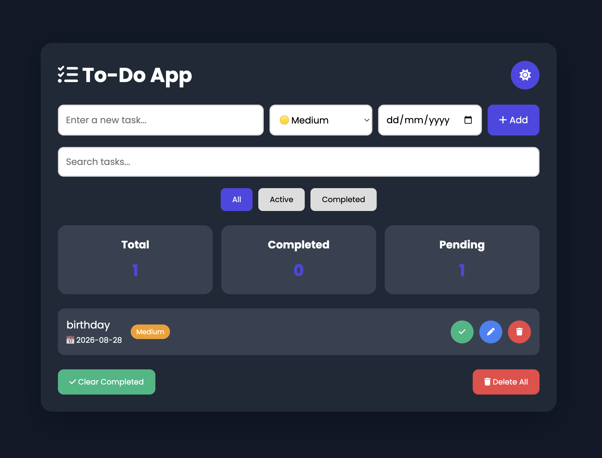

# 📝 Advanced To-Do App

A modern and responsive To-Do App built using HTML, CSS, and JavaScript.

## 🚀 Live Demo
 https://solanki-tarun.github.io/todo-app/

 ---

## ✨ Features

- ✅ Add Tasks
- ✏️ Edit Tasks
- 🗑 Delete Tasks
- ✔️ Mark Tasks as Completed
- 🔍 Search Tasks
- 📂 Filter Tasks
- 🌙 Dark Mode
- 📅 Due Date
- 🟡 Priority Levels
- 💾 Local Storage
- 📊 Task Statistics
- 🧹 Clear Completed Tasks
- ❌ Delete All Tasks
- 📱 Responsive Design

---

## 🛠 Technologies Used

- HTML5
- CSS3
- JavaScript (ES6)

---
## update 
 Day 1: Add local storage
 day 2: update new system 
 day 3: new ui sysytem
 
## Project Output

## 📂 Project Structure

todo---app/
│── index.html
│── style.css
│── script.js
└── README.md

---
## Future Plan
-- add ui 
-- add new system
-- update system
-- update ui

## 👨‍💻 Author

**Tarun Solanki**

GitHub:
https://github.com/solanki-tarun

---

⭐ If you like this project, don't forget to star the repository.
